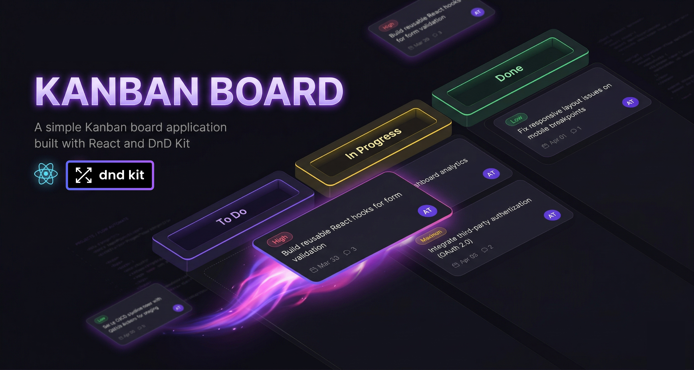

# Kanban Board

A modern, fully interactive Kanban board built with React 19 featuring drag-and-drop task management, optimistic UI updates with rollback, and a responsive design.



## Features

- **Drag & Drop** -- Move tasks between columns with smooth drag-and-drop powered by `@dnd-kit`. Supports both cross-column moves and within-column reordering.
- **Optimistic Updates with Rollback on failure**
- **Dynamic Columns** -- Add new columns or delete existing ones.
- **Live Search** -- Real-time task filtering.
- **Task History** -- Scrollable modal showing all tasks with their title, date, and current column.
- **Responsive Design**

## Tech Stack

| Tool                 | Purpose                         |
| -------------------- | ------------------------------- |
| React 19             | UI framework                    |
| Vite 8               | Build tool & dev server         |
| @dnd-kit/core 6      | Drag-and-drop engine            |
| @dnd-kit/sortable 10 | Sortable list primitives        |
| Sonner               | Toast notifications             |
| vite-plugin-svgr     | SVG imports as React components |

## Getting Started

### Prerequisites

- Node.js 18+
- npm or yarn

### Installation

```bash
git clone https://github.com/arbaz9234/Kanban-Board.git
cd Kanban-Board
npm install
```

### Development

```bash
npm run dev
```

### Build

```bash
npm run build
npm run preview
```

## How the Optimistic Update Works

1. User drags a task to a new column
2. UI updates **instantly** (optimistic)
3. A mock API call is made (1.5s delay)
4. **On success** -- toast confirms the move
5. **On failure (20% chance)** -- task snaps back to its original column with a rollback animation and error toast
